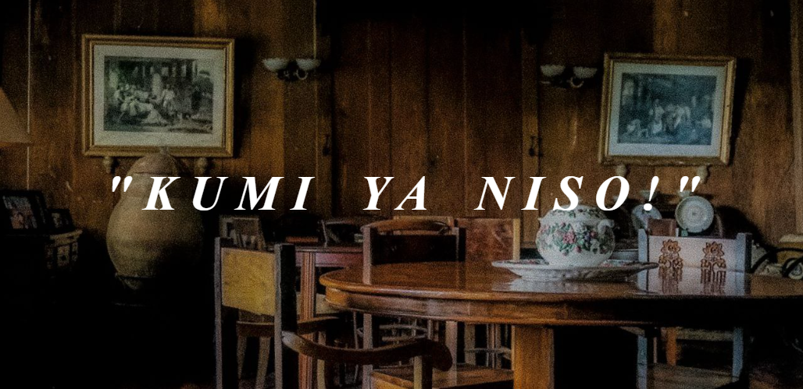

# Kabite-Cusine

  

<b> Kumí ya niso — kain na tayo! (Let’s eat!) </b>

This is a simple HTML-based website that showcases the rich and flavorful world of Caviteño food. Influenced by its coastal location and deep historical roots, Cavite offers a unique mix of savory and sweet dishes that reflect its vibrant culture. The site invites users to explore traditional favorites and hidden culinary gems—from hearty main courses to classic local desserts. Designed as a visual journey through Cavite's kitchens, Kabite Cuisine celebrates the province’s diverse flavors in a clean and accessible way.
